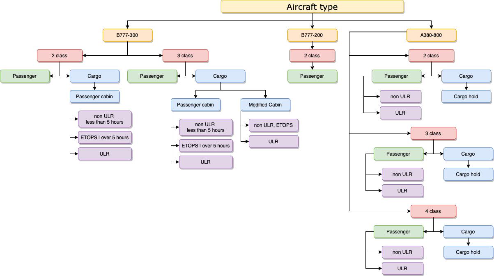
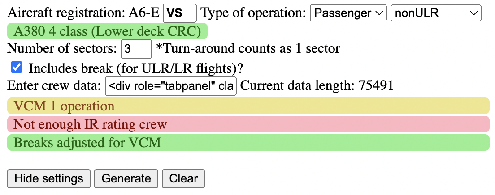
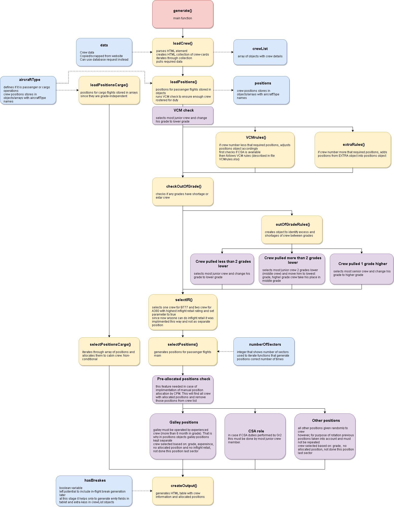
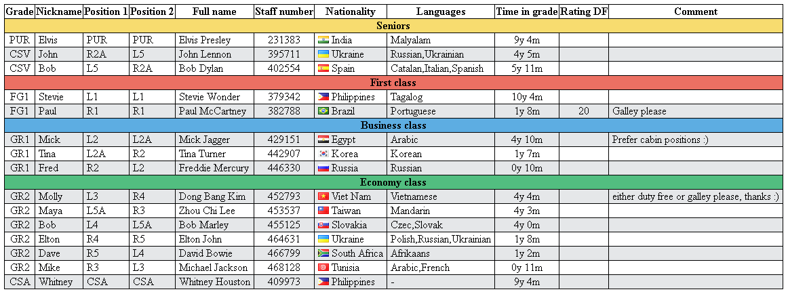
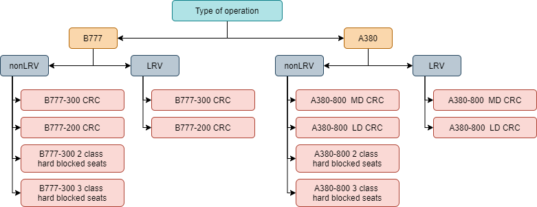

# Automatic allocation of cabin crew positions

Allocating crew positions before the flight can be a challenging task.   
Many rules and requirements involved in the process and at times it can be time consuming. 

### Aim
When writing this code I pursued the following:
- Allow crew members to know their __positions before the flight__, so they can learn related duties (safety and security search areas, service duties etc.) before the flight and prepare well for duty. This includes the break allocation for ULR trips as well. 
- __Consistency on every flight__. Positions should be included in pre-flight email. However, everyone does it in different way: sometimes chosen at briefing, sometimes allocated only for one sector, sometimes sent without break times etc.
- __Consider crew experiences__, when allocating galley duties, working out of grade, selecting in-flight retail operator etc. Work positions connected to specific duties conducted in-flight (galley, inflight retail, on board camera etc.). This means that giving right position to a right person will contribute to success of the flight, ensure duties completed accordingly, lead to high levels of customer satisfaction and help crew to develop new skills.
- __Consider crew development needs__. Allow crew positions rotation after full filling company requirements. Algorithm will check previous working positions and select a different one for each sector that allows you to try different positions helps you to learn equipment location, responsibilities for different tasks, cabin layouts. Rotation of work positions gives crew a fresh feeling when working in different area rather than repeating same job every time. I also left room for manual pre-allocation of positions by CCM in case if required.
- __Break "seniority" culture__ and avoid conflicts when allocating crew positions

### Considerations
Things that affect positions allocation:
* operating with VCM or extra crew (rare case due to aircraft change)
* crew operating as other grade (e.g. PUR and Fg1)
* galley should be operated by experienced crew member (>6 month in current grade)
* in-flight retail can not be operated by probation crew members
* in-flight retail should be operated by crew with highest sale rank
* number of sectors on the trip
* requirement for hard-blocked/CRC in-flight rest
* temporarily requirement for CSA on all cat.2+ flights
* type of operation (aircraft type, number of cabins, cargo/passenger operation)

__Possible variants of crew positions on different types of operation:__   



### Input
Since I have no information about database structure, I used available source of information to me - cabin crew portal. Crew information can be copied from tag `<div id="tab-crew-0">` or web-scrapped with tools like [cheerio](https://www.npmjs.com/package/cheerio "cheerio") or [puppeteer](https://www.npmjs.com/package/puppeteer "puppeteer").

However, the older [version](https://github.com/nevtemu/crew-positions-mongo "version") of the code uses dummy MongoDB database to pull and push data. And crew information data retrieval can be changed to a database read request in function `loadCrew()`.

Same applies for flight settings (type of aircraft, number of sectors, type of operation cargo/passengers ULR/nonULR, flight category etc.). Their can be pulled directly from database, but in my case input manually via html page. I just created "Hide" button to hide them, when printing the output data.



## Algorithm overview
Here is brief algorithm overview:


I attempted to write code in such way that it is not linked to current procedures. Most of things scalable: if different type of position, different type of operation added, there is no need to rewrite entire code. For example, new position can be added to galley position type in positions object. 
Only about 100 lines of code handles entire algorithm. The rest is hardcoded data (will be replaced with requests to database) and exceptional rules handlers (VCM, extra crew, out of grade etc.).
#### Rotation
Currently position rotation implemented as array of previous positions `lastPosition = ["R2", "L2"]`. It is set length for different grades: 0 for PUR and CSA (not required), 1 for FG1 and CSV (to not repeat one last position), 2 for other grades (to not repeat two last positions). Values can be adjusted.
However, this can be chnaged to database entries, that will allow to track percentages of operated positions and other trends. This can be used when filtering crew for positions (instead of lastPosition array) to facilitate position rotation between sectors.
#### In-flight retail
As per current procedure one retail operator for B773 and two for A380 are allocated. However, since this does not depend on grade or position any more (only on inflight retail sales rank), it is just added as `inflightRetail = true` value. The only requirement is not to give galley position to such crew.
In previous versions inflight retail was linked to position and handled via positions object like this:
```
GR1: {
    galley: ["L2A"], 
    retail: ["L2"]
    main: ["R2"]
    },
```
#### CSA duties
All current rules regarding CSA implemented. Can be allocated to CSA or most junior Gr2 member.
#### Cargo flights
Since different grades can be assigned cargo flights, positions represented in simple array (without link to operating grade). Also many handlers are skipped (in-flight retails, CSA etc.) as not applicable for cargo flights. So entire cargo operations algorithm bypasses passengers algorithm and goes directly to output.
#### Break allocation
I prepared fields for break allocation and handler for number of sectors. To feature in just need to add function that will read breaks related to allocated position and pass them to crew object. This must be run after function `selectPositons()` since break times depends to working position.
#### Crew preferences
Currently only implemented processing for crew comments on the portal, where they often request preferred position. However, this is only for output table and not taken into account by algorithm. Idealy I want to implement another field in database, where crew can select favorite position and will be given priority over other crew, if multiple crew available after filtering crew list.

### Output
Both input and ouput fields can be styled with side libraries (like Bootstrap), but I wrote this for functionality, not for design. Also JS code will look much nicer for input/output with React (or JS frameworks), but I did not want to include such large library, so used vanila JS.
I made HTML tablet output for generated positions. This if for printing purposes only (to include in crew pre-flight e-mail). If system generated positions will be implemented, they will be written to database and displayed directly under trip information on cabin crew portal.


### Breaks alocation
Started work on automatic break allocation. Most of them linked to work positions already and directly specified in crew rest strategies (PUR, CSA, CSV). For others we can select automatically and implement rotation or just link breaks directly to working position for all crew. Rotation of positions will support rotation of breaks.   
Totally 12 types of breaks allocation exists (not counting temporarily procedure for long turnarounds):

   
I decided to go with random choice of break for first sector and then rotation. This excludes Gr1 break allocation on B777-300 as number of crew on each break is not equal.

Thank you.

### Changelog
- Minimum required crew compliment implemented in VCMrules() function
- Support galley operator for A380 is not implemented. Since this can be easily assigned by CSV. Otherwise suggested to move support galley operator position into galley type for A380 positions object.
- 4 class A380 implemented
- implemented PCR test requirement check
- Gr2 as CSA icon not implemented - can not find live example to work with
- implemented automatic breaks allocation with break rotation between sectors    
7.07.2021   
- Corrected positions for B777-200. 2 CSV now rostered and 3 Gr1
- removed temporarily CSA rules from all aircraft types except A380-800 3 class
- added error handler and error display field in HTML, added tabindex for keyboard navigation
- moved mid galley position to L3 on all B777 aircrafts
- fixed empty nickname field for crew without nickname (uses first name instead)   
05.10.2021    
- corrected positions for A380 3 class
- implemented recommended positions for inflight retail operators
- added 4 class A380
- added reminder about MFP 2.0 related changes in the output file     
24.11.2021     
- fixed bug with inflight retail positions
- PCR check completely removed since 100% vaccination requirement 
24.05.2022     
- Fixed conflict between VCM and IR allocation. Added addition VCM rules
- Fixed rare bug for crew without CPM
- Updated fleet data
- Added short names for Macedonia, Bosnia, Moldova