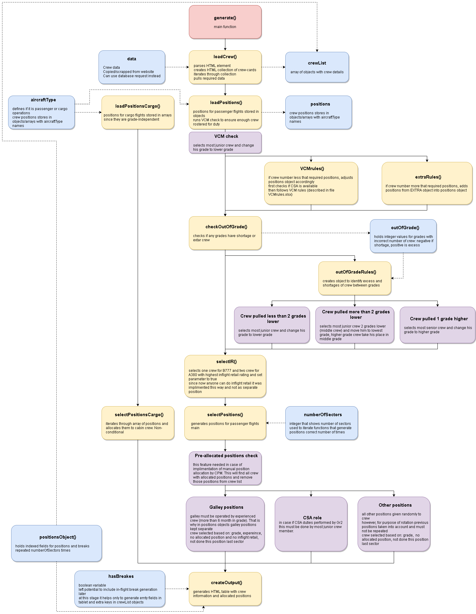

# Automatic allocation of cabin crew positions

Allocating crew positions before the flight can be a challenging task. Many rules and requirements involved in the process and at times it can be time consuming. 

When writing this code I pursued the following:
- Allow crew members to know their positions before the flight, so they can learn related duties (safety and security search areas, service duties etc.) before the flight and prepare well for duty. This includes the break allocation for ULR trips as well. 
- Consistency on every flight. Since now positions can be in email, sometimes choosen at briefing, sometimes allocated only for one sector, sometimes sent without break times etc.
- Consider crew experiences, when allocating galley duties, working out of grade, selecting in-flight retail operator etc. Work positions connected to specific duties conducted in-flight (galley, inflight retail, on board camera etc.). This means that giving right position to a right person will contribute to success of the flight, ensure duties completed accordingly, lead to high levels of customer satisfaction and help crew to develop new skills.
- Consider crew development needs. Allow crew positions rotation after fullfilling company requirements. Algorithm will check previous working positions and select a different one for each sector that allows you to try different positions helps you to learn equipment location, responsibilities for different tasks, cabin layouts. Rotation of work positions gives crew a fresh feeling when working in different area rather than repeating same job every time. I also left room for manual pre-allocation of positions by CCM in case if required.
- Break "seniority" culture and avoid conflicts when allocating crew positions

Things that affect positions allocation:
* operating with VCM or extra crew (rare case due to aircraft change)
* crew operating as other grade (e.g. PUR and Fg1)
* galley should be operated by experienced crew member (>6 month in current grade)
* in-flight retail can not be operated by probational crew members
* in-flight retail should be operated by crew with highest sale rank
* number of sectors on the trip
* requirement for hard-blocked/CRC in-flight rest
* temporarly requirement for CSA on all cat.2+ flights
* type of operation (aircraft type, number of cabins, cargo/passenger operation)

Possible variants of crew positions on different types of operation:  

### Input
Since I have no information about database structure, I used available source of information to me - cabin crew portal. Crew information can be copied from tag `
` or web-scrapped with tools like [cheerio](https://www.npmjs.com/package/cheerio "cheerio") or [puppeteer](https://www.npmjs.com/package/puppeteer "puppeteer").

However, the older [version](https:// "version") of the code uses dummy MongoDB database to pull and push data. And crew information data retriwal can be changed to a database read request in function `loadCrew()`.

Same applies for flight settings (type of aircraft, number of sectors, type of operation cargo/passengers ULR/nonULR, flight category etc.). Their can be pulled directly from database, but in my case input manually via html page. I just created "Hide" button to hide them, when printing the output data.

### Algoruthm overview
Here is brief algorithm overview:

#### Note about break allocation:
I prepeared fields for break allocation and handler for number of sectors. To feature in just need to add function that will read breaks related to allocated position and pass them to crew object. This must be run after function `selectPositons()` since break times depends to working position.

### Output
I made HTML tablet output for generated positions. This if for printing purposes only (to include in crew pre-flight e-mail). If system generated positions will be implimented, they will be written to database and displayed directly under trip information on cabin crew posrtal.
